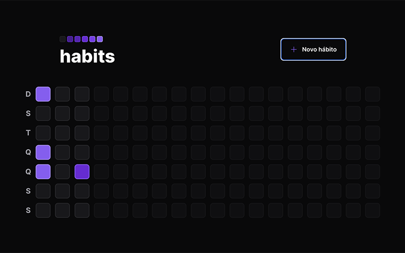
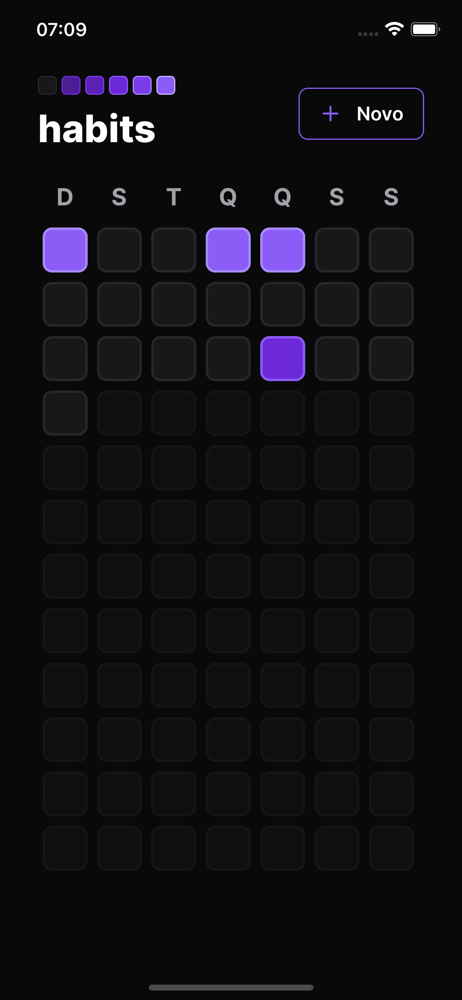

# Habits Tracker App

Create new habits and keep track of your progress!

- Web: React, Typescript, Vite, Tailwind CSS
- Mobile: React Native, Expo, NativeWind, Typescript
- Server: Node, Fastify, Prisma, Typescript, SQLite, Zod

To run locally clone the repository and run:
<br>

```
$ cd server && npm run dev
$ cd web && npm run dev
$ cd mobile && npm start
```

<br>

<br>

